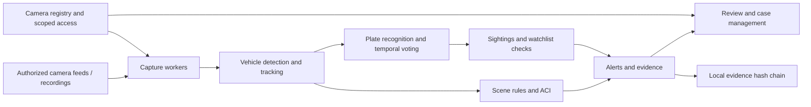

# GUIVIN — Gujarat Unified Intelligent Video Intelligence Network

> **From camera feeds to actionable investigations.**
>
> Built for **Sentinel Gujarat 2026** · Camera intelligence · Contextual alerts · Evidence verification

GUIVIN brings camera monitoring, AI-assisted vehicle analysis and investigation workflows into one dashboard. Operators can locate cameras on a map, analyze authorized feeds, review alerts, trace vehicle sightings and organize evidence into cases.

**Register → Monitor → Detect → Review → Investigate**

[Features](#features) · [Quick Start](#quick-start) · [Sentinel Integration](#sentinel-integration) · [Architecture](#architecture) · [Documentation](#documentation)

---

## Features

- **📷 GIS Camera Registry** — Search and onboard cameras, inspect worker health and display declared coverage on a Leaflet map. Cameras without verified coordinates remain in the inventory.
- **🔍 AI-Assisted ANPR** — YOLOv8n vehicle detection, EasyOCR recognition, multi-line plate assembly and repeated-observation voting.
- **📡 Live Monitor** — Authorized RTSP analysis, recorded-video processing, annotated previews and per-camera Start/Stop controls.
- **🌐 Sentinel Integration** — Camera Grid authentication, catalogue import and individual connection results for successful and failed workers.
- **⚠️ Alerts & Watchlists** — Representative watchlist matching, evidence-linked alerts and independent supervisor review for high-severity dismissals.
- **🚔 VAHAN / CCTNS Integration** — Live simulation of the national vehicle registry. Every detected plate is cross-referenced to instantly flag stolen vehicles, wanted suspects, or expired PUCs.
- **📊 Adaptive Camera Intelligence** — Versioned statistical baselines with coverage gates, approval and rollback, alongside opt-in region, tripwire, crowd and loitering rules.
- **🚗 Vehicle Journeys** — Time-filtered sightings across cameras, pagination and topology-based correlation with uncertainty indicators.
- **🗂️ Case Management** — Link alerts, assign supervisors, escalate investigations and grant scoped judiciary access.
- **🔗 Evidence Integrity** — Captured frames, sampled pre/post-event clips and a local SHA-256 hash chain with verification and download controls.
- **🔐 Role-Based Access** — Seven operator and oversight roles with department, camera and case-level permissions.
- **📄 Reports** — Incident CSV/PDF exports, detection records and offline evaluation tools.

## Architecture



FastAPI connects the dashboard to capture workers, analytics and investigation workflows. SQLite stores application records, while captured evidence is stored separately and checked against the local hash chain. Docker Compose packages the application for a single host.

## Quick Start

### 1. Clone the Repository
Begin by cloning the project to your local machine:
```bash
git clone https://github.com/your-org/guivin-project.git
cd guivin-project
```

### 2. Run with Docker (Recommended)
The easiest way to run GUIVIN with its full AI pipeline is using Docker Desktop (with Linux containers).

```bash
# Build and start the services in the background
docker compose build
docker compose up -d
```
*Note: The first run may take a few minutes to download the AI models and base images.*

**Access the Dashboard:**
Open **http://localhost:8001** in your web browser. 
Sign in with the username `local-admin`. The auto-generated password is saved in `tmp/docker/admin-password.txt` on your first run.

```bash
# To stop the application (your database and evidence will be saved)
docker compose stop
```

### 3. Native Python Setup (Optional)
If you prefer running without Docker, ensure you have Python 3.11 installed.

```powershell
# Create a virtual environment and install dependencies
python -m venv .venv
.\.venv\Scripts\Activate.ps1
pip install -r backend/requirements.txt

# Download AI models (YOLO, EasyOCR, and high-accuracy PaddleOCR)
python tools/setup_models.py --download
python tools/setup_fast_alpr.py --download-detector --download-paddle
python tools/prepare_paddle_anpr.py --detector-bundle tmp/fast-alpr --paddle-root tmp/paddle-evaluation/.paddlex/official_models --output tmp/fast-alpr-paddle

# Start the local development server (with PaddleOCR enabled)
$env:GUIVIN_ANPR_BACKEND="fast_alpr"
$env:GUIVIN_ANPR_MODEL_DIR="tmp/fast-alpr-paddle"
.\run-local.ps1
```
Open **http://localhost:8000** in your browser.

## Sentinel Integration

1. Sign in to GUIVIN and open **Live Monitor → Connect Sentinel**.
2. Enter your authorized Camera Grid email and access password.
3. Start with one camera, then inspect its preview and health status.
4. Review the started/failed worker results before adding more cameras.

The tested integration uses **RTSP over TCP**. Sentinel sandbox recordings are labeled **RECORDED**; demo-generated alerts are labeled **SIMULATED**. If an old worker is still stopping, wait for it to finish before retrying. Credentials are cleared from the connection form after the request.

## Operator Workflow

1. **Register** — Import or onboard cameras and confirm available location metadata.
2. **Monitor** — Start authorized feeds and inspect capture/inference health.
3. **Review** — Open alerts, examine frames and sampled clips, and verify evidence integrity.
4. **Investigate** — Search plate sightings, inspect journey uncertainty and link relevant alerts to a case.
5. **Coordinate** — Assign scoped reviewers, escalate cases and export reports.

Supported roles: **Field Operator, Sector Supervisor, Department Head, SCRB Administrator, Technical Administrator, Auditor and Judiciary**. Access is scoped to the account's permitted resources.

## Tech Stack

- **Backend:** Python · FastAPI · SQLAlchemy · SQLite (WAL mode) · Uvicorn
- **Computer vision:** YOLOv8n · PaddleOCR · FastALPR · EasyOCR · CLAHE Preprocessing · OpenCV
- **Frontend:** HTML/CSS · Vanilla JavaScript · Leaflet · hls.js
- **Streaming:** RTSP/TCP ingestion · MJPEG previews · HLS proxy support
- **Evidence:** SHA-256 hashing · Local chain verification · Sampled video clips
- **Deployment:** Docker Compose · External model mounts · Persistent state volume

## Project Structure

```text
guivin-project/
├── backend/
│   ├── app/
│   │   ├── main.py             # FastAPI routes and WebSocket updates
│   │   ├── ai_pipeline.py      # Vehicle detection and plate recognition
│   │   ├── tracking.py         # Within-camera tracking and plate consensus
│   │   ├── stream_manager.py   # Capture, inference workers and stream health
│   │   ├── sentinel_connector.py # Camera Grid authentication and catalogue
│   │   ├── camera_registry.py  # Camera onboarding, metadata and GIS
│   │   ├── alert_manager.py    # Alerts and evidence capture
│   │   ├── aci_learning.py     # Baseline candidates, approval and versions
│   │   ├── scene_rules.py      # Regions, tripwires, crowd and loitering rules
│   │   ├── cases.py            # Case workflows and scoped assignments
│   │   ├── clip_evidence.py    # Sampled pre/post-event video evidence
│   │   ├── blockchain_ledger.py # Local evidence chain and verification
│   │   ├── auth.py             # Account authentication and sessions
│   │   ├── permissions.py      # Role and resource access checks
│   │   └── database.py         # Models, persistence and schema upgrades
│   ├── data/                   # Representative seed cameras and watchlists
│   └── requirements.txt
├── frontend/
│   ├── index.html              # Operator dashboard
│   └── static/
│       ├── css/styles.css      # Dashboard styling
│       └── js/
│           ├── dashboard.js   # Stream controls and real-time updates
│           ├── gis-map.js     # Map, registry and coverage controls
│           ├── alerts.js      # Alert feed and review actions
│           ├── journey.js     # Vehicle sighting searches
│           ├── operations.js  # ACI review, clips and case management
│           └── blockchain.js  # Evidence ledger and integrity checks
├── deploy/                     # Container setup and deployment guide
├── tests/                      # Backend and connection-handler regression tests
├── tools/                      # Model setup, accounts, evaluation and backups
├── anpr_runner.py              # Standalone processing entry point
├── compose.yaml
└── Dockerfile
```

## API Endpoints

Interactive API documentation is available at **http://localhost:8001/docs** when running Docker. The API covers camera registration, stream control, alerts, vehicle journeys, evidence, ACI profiles, cases and reports.

Selected endpoints:

- **Registry:** `GET /api/cameras`, `GET /api/cameras/geojson`, `POST /api/cameras/bulk` — List, map and import cameras.
- **Monitoring:** `POST /api/stream/start`, `POST /api/stream/{camera_id}/stop`, `GET /api/stream/{camera_id}/health` — Control processing and inspect camera health.
- **Sentinel:** `POST /api/sentinel/connect` — Authenticate, import selected cameras and request worker startup.
- **Alerts:** `GET /api/alerts`, `POST /api/alerts/{alert_id}/acknowledge` — Retrieve and acknowledge alerts.
- **Journeys:** `GET /api/journey/{plate}` — Search time-filtered vehicle sightings.
- **Evidence:** `GET /api/evidence/{alert_id}/clip/preview`, `GET /api/evidence/{alert_id}/clip/verify` — Preview a sampled clip and verify its integrity.
- **Ledger:** `GET /api/blockchain/ledger`, `POST /api/blockchain/verify` — Inspect and verify the local evidence chain.
- **ACI:** `GET /api/aci/{camera_id}/profiles`, `POST /api/aci/{camera_id}/profiles/{profile_id}/approve` — Inspect baseline versions and approve a candidate.
- **Reports:** `GET /api/reports/csv`, `GET /api/reports/pdf`, `GET /api/reports/detections` — Export incidents and detection records.
- **System:** `GET /api/health` — Inspect service and model readiness.
- **Observability:** `GET /metrics` — Export Prometheus-compatible metrics for DevSecOps monitoring.

Protected endpoints enforce account permissions and resource scope. See the interactive API for request bodies, filters and response schemas.

## Validation

Regression coverage includes scoped access, evidence verification, camera onboarding, source timing, OCR processing and connection failures. The latest verification passed **87 Python tests** and **four JavaScript connection-handler scenarios**.

```bash
node tests/test_sentinel_ui.cjs
```

The project includes offline OCR comparisons, evaluation metrics and backup verification tools. Model assets, credentials, evidence and downloaded datasets stay outside version control.

## Documentation

- [Deployment guide](deploy/README.md) — Docker setup, model preparation and accounts.
- [Interactive API](http://localhost:8001/docs) — Explore endpoints with the Docker app running.
- [Tests](tests/) — Regression coverage for backend behavior and connection handling.
- [Security policy](SECURITY.md) — Security reporting information.

## Project Status

GUIVIN is a hackathon prototype with implemented monitoring and investigation workflows. Watchlists are representative demo data. Evidence verification currently uses a local hash chain; Fabric/IPFS integration, encrypted evidence storage and distributed deployment remain roadmap work. Journey correlations and AI alerts support operator review rather than establish identity or legal conclusions.

## Future Scope

The next phase focuses on stronger plate recognition across varied road conditions, calibrated cross-camera correlation and richer scene learning. Deployment work will target sustained multi-camera processing, coordinated workers and shared services before Kubernetes scaling. Planned evidence and security enhancements include Fabric/IPFS integration, encrypted storage and stronger identity controls, supported by broader evaluation on authorized footage.

## License

[MIT](LICENSE) — built for Sentinel Gujarat 2026. Third-party models, libraries and evaluation datasets retain their own licenses.
